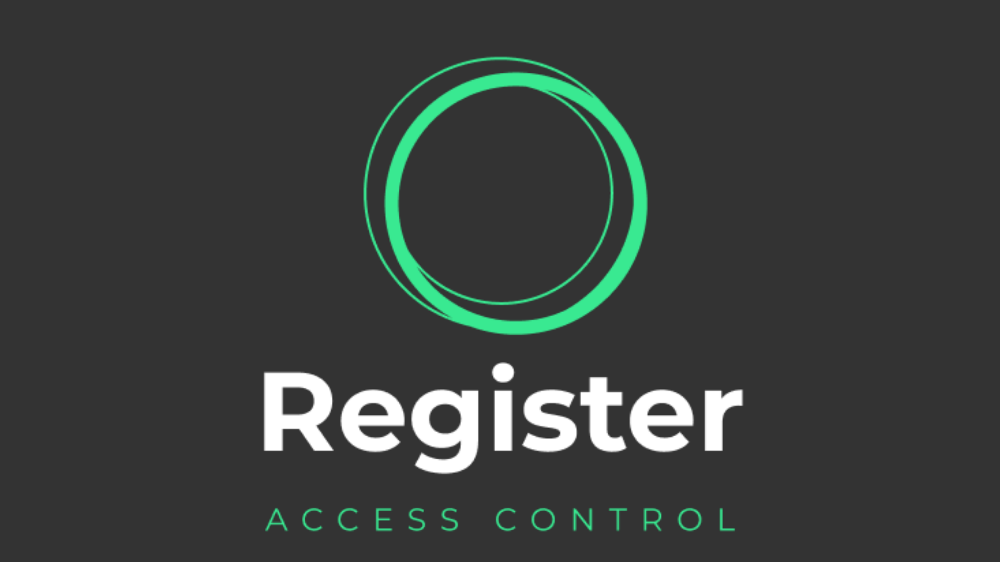
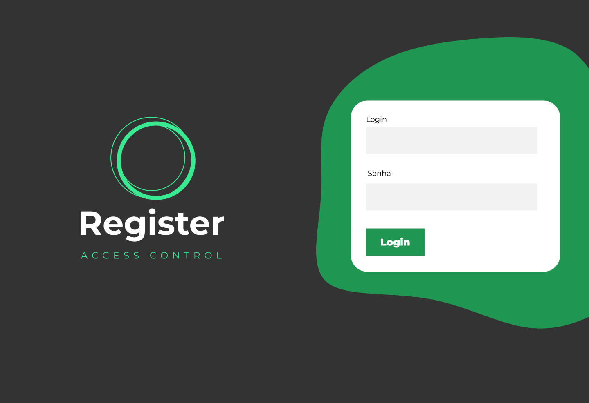
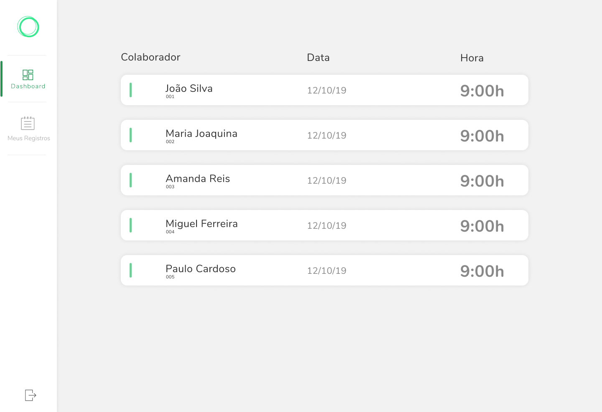
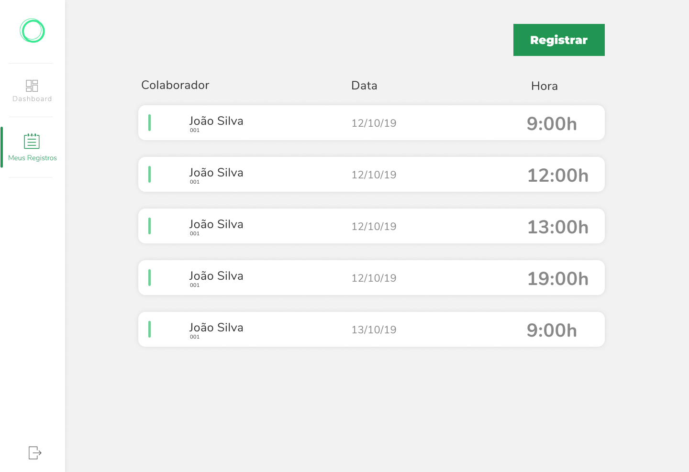
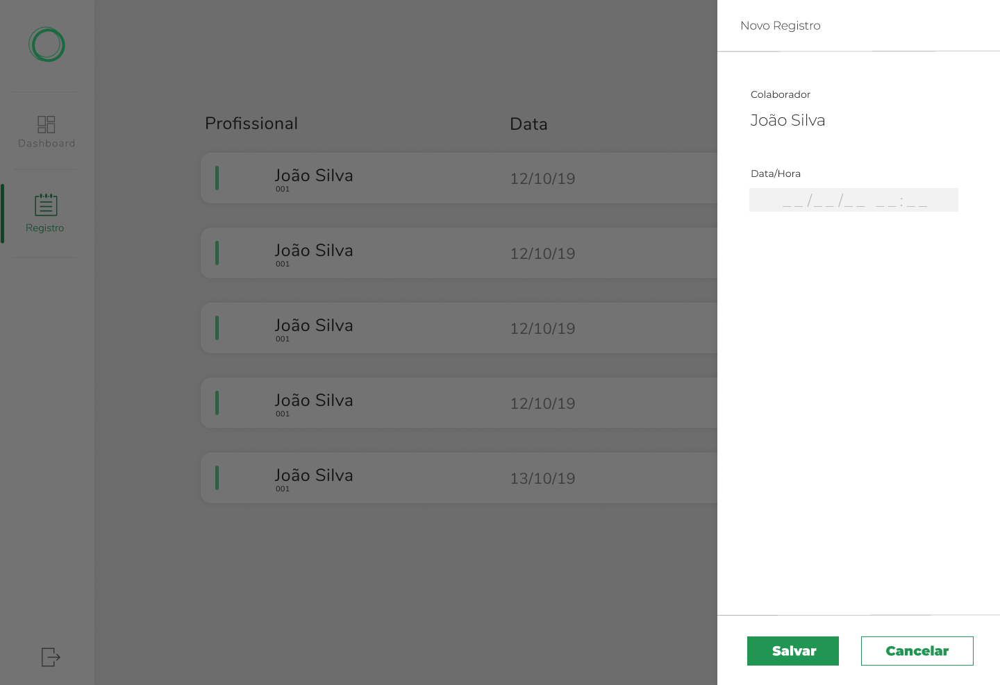

  

  Sistema para o gerenciamento de Registros de Ponto dos colaboradores de uma empresa.

  

  

  

  

  

  <a href="#-sobre-o-projeto">Sobre o Projeto</a>&nbsp;&nbsp;&nbsp;|&nbsp;&nbsp;&nbsp;
  <a href="#-tecnologias-utilizadas">Tecnologias Utilizadas</a>&nbsp;&nbsp;&nbsp;|&nbsp;&nbsp;&nbsp;
  <a href="#-como-rodar">Como rodar</a>&nbsp;&nbsp;&nbsp;|&nbsp;&nbsp;&nbsp;
  <a href="#-layout">Layout</a>&nbsp;&nbsp;&nbsp;|&nbsp;&nbsp;&nbsp;
  <a href="#-licença">Licença</a>

---

## 💻 Sobre o Projeto

Esse projeto é um sistema para o gerenciamento de Registros de Ponto dos colaboradores de uma empresa, no qual cada colaborador efetuará autenticação e realizará o registro do seu ponto diariamente.

### Requisitos Funcionais
- [**RF01**] - Gerenciar registros de horários;
- [**RF02**] - Registrar horário de entrada e saída do colaborador;
- [**RF03**] - O usuário com permissão de administrador poderá visualizar em tempo real os registros dos colaboradores, sem a necessidade refresh de página.

### Requisitos Não Funcionais
- [**RNF01**] - Apenas os colaboradores podem bater o ponto;
- [**RNF02**] - Apenas o administrador do sistema poderá visualizar a lista com os registros dos colaboradores;
- [**RNF03**] - Apenas o administrador do sistema poderá cadastrar novos colaboradores;
- [**RNF04**] - Desenvolvimento de API em NestJS e GraphQL com Apollo;
- [**RNF05**] - O sistema utilizará autenticação com JWT;

## 🚀 Tecnologias Utilizadas

Esse projeto foi desenvolvido com as seguintes tecnologias:

- [React JS](https://reactjs.org/)
- [TypeScript](https://www.typescriptlang.org/)
- [GraphQl](https://graphql.org/)
- [Apollo](https://www.apollographql.com/)
- [Material UI](https://material-ui.com/)

## ⚡ Como rodar

### Requisitos

- [Points Register - API](https://github.com/goncadanilo/points-register-api).

### Intalar as dependências

- instale as dependências: `yarn`.

### Rodar a aplicação

- para rodar a aplicação: `yarn start`.
- a aplicação estará disponível no endereço: `http://localhost:3000`.

### Acessar a aplicação

- faça login como **administrador**:
  - `Email: admin@brainny.cc`
  - `Senha: admin123`
- crie um novo usuário na página `Usuários`.
(apenas **administradores** podem criar outros usuários)
- faça login com as credenciais do novo usuário e adicione novos registros.

## 🔖 Layout

#### Login

  

#### Dashboard

  

#### Meus Registros

  

#### Novo Registro

  

## 📝 Licença

Esse projeto está sob a licença MIT. Veja o arquivo [LICENSE](LICENSE) para mais detalhes.

---

Feito com ♥ by [Danilo Gonçalves](https://github.com/goncadanilo). Me adicione no [LinkedIn](https://www.linkedin.com/in/goncadanilo/) :wave:
